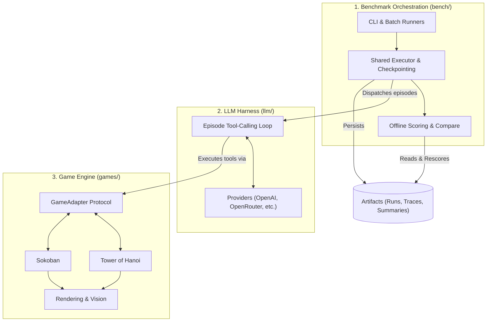

# 🎮 GamesBench

[](https://www.python.org/downloads/)
[](https://opensource.org/licenses/MIT)

**GamesBench** is a framework-agnostic, reproducible benchmark stack for evaluating **long-horizon planning** and **spatial reasoning** in tool-calling LLMs and RL agents.

By moving beyond simple QA evaluation, GamesBench measures agent behavior through extended trajectories in challenging, highly interactive game environments.

---

## ✨ Key Features

- 🔄 **Strict Layer Decoupling:** Game environments are completely standalone and can be reused outside the benchmark. The LLM harness only interacts through a strict `GameAdapter` protocol.
- 🗂️ **Separated Generation & Scoring:** Generate traces once, then rescore offline asynchronously. Supports updating taxonomy or metrics without expensive LLM re-runs.
- 💾 **First-Class Checkpoint & Resume:** Native support for resuming interrupted long runs, with strict validation to prevent job duplication or configuration mismatch.
- 📊 **Robust Provenance & Lineage:** Every run generates a `run_manifest.json` capturing git hashes, process args, and prompt hashes to guarantee deterministic reproducibility.
- ⚖️ **Regression Governance:** Built-in `compare` CLI commands support pass/fail gating with configurable threshold schemas to catch regressions in CI.

---

## 🏛️ Architecture

GamesBench is explicitly divided into three primary layers to ensure reusability and scalability.



---

## 🎲 Environments

GamesBench features canonical game suites explicitly chosen to stress-test specific reasoning modalities:

### 🗼 Tower of Hanoi
- **Focus:** Sequential planning, deep search trees, and long-horizon execution.
- **Features:** Supports varying disk and peg counts. Tests an agent's ability to maintain a mental stack of intermediate objectives and recognize optimal pathing.

### 📦 Sokoban
- **Focus:** Spatial reasoning, geometry, and deadlock avoidance.
- **Features:** Agents must avoid irreversible actions. Includes both human-authored starter levels and procedural generation (`procgen`) for large-scale evaluation sweeps.

---

## 🚀 Quickstart

### Installation

GamesBench uses `uv` for dependency management. The base package has zero external dependencies!

```bash
# Clone the repository
git clone https://github.com/your-org/games_bench.git
cd games_bench

# Base install (core tools + dev formatters)
uv sync

# Install optional groups (recommended for evaluation)
uv sync --group llm --group viz --group bench
```
*Equivalent `pip` installs are available: `pip install 'games-bench[llm,viz,bench]'`*

### Fastest way to run the benchmark

The benchmark is **suite-first**. Start with our predefined suites (`easy-v1`, `standard-v1`):

```bash
# 1. Export your API keys (e.g., OpenRouter, OpenAI)
export OPENROUTER_API_KEY="sk-or-..."

# 2. List available suites
uv run games-bench run --list-suites

# 3. Run the easy suite on a specific model
uv run games-bench run --provider openrouter --model anthropic/claude-3-haiku --suite easy-v1

# 4. Run a single game from a harder suite
uv run games-bench run --provider openrouter --model anthropic/claude-3-opus --suite standard-v1 --game hanoi
```

---

## 🛠️ Common Workflows

### 1️⃣ Reproducible Runs & Resumes
Run a model with a deterministic ID. If the run is interrupted, resume it safely without losing completed episodes.

```bash
# Start a run
uv run games-bench run --provider openrouter --model meta-llama/llama-3-8b-instruct \
  --suite easy-v1 --run-id llama3_baseline

# Resume interrupted run (with strict continuity checks)
uv run games-bench run --provider openrouter --model meta-llama/llama-3-8b-instruct \
  --suite easy-v1 --run-id llama3_baseline --resume --strict-resume
```

### 2️⃣ Separation of Generation & Scoring
Generate episode traces without scoring them inline, then run the scorer offline.

```bash
# Generate only (writes traces.jsonl and episodes.jsonl, skips summary)
uv run games-bench run --provider openrouter --model my_model --suite easy-v1 --no-score

# Score offline from generated artifacts
uv run games-bench score --run-dir artifacts/runs/.../my_model/my_run_id
```

### 3️⃣ Regression Compare
Compare a baseline run against a candidate run to detect performance drops, applying threshold gating.

```bash
uv run games-bench compare \
  --baseline artifacts/runs/baseline_run/ \
  --candidate artifacts/runs/candidate_run/ \
  --thresholds thresholds.json \
  --fail-on-regression
```

### 4️⃣ Single Episode Demo (Provider Harness)
Test a specific model directly on a single episode from the command line.

```bash
uv run games-bench provider --provider openrouter
```

---

## 🧩 Extending GamesBench

Adding a new game to GamesBench is straightforward and doesn't require modifying the core LLM harness.

1. **Create the Environment:** Add `games_bench/games/<my_game>/env.py` and `adapter.py`.
2. **Implement Protocol:** Ensure `adapter.py` satisfies the `GameAdapter` protocol (`tool_schemas`, `execute_tool`, `is_solved`, etc.).
3. **Register:** Register the environment in `games_bench/games/registry.py`.
4. **Create Batch Runner:** Add `games_bench/bench/<my_game>.py` with logic for running batches and default configs. Register it in `games_bench/bench/registry.py`.

For strict guidelines on layer boundaries and repository expectations, see:
- [AGENTS.md](AGENTS.md)
- [CLAUDE.md](CLAUDE.md)
- [Architecture Details](architecture.md)

---

## 📁 Repository Layout

```text
games-bench/
├── games_bench/
│   ├── games/      # Game engine & environments (Hanoi, Sokoban)
│   ├── llm/        # Game-agnostic LLM harness & providers
│   └── bench/      # Orchestration CLI, registries, and offline scoring
├── configs/        # JSON configuration overrides for bench suites
├── artifacts/      # Generated runs, renders, and reviews (gitignored)
└── tests/          # Extensive architectural and execution testing
```
